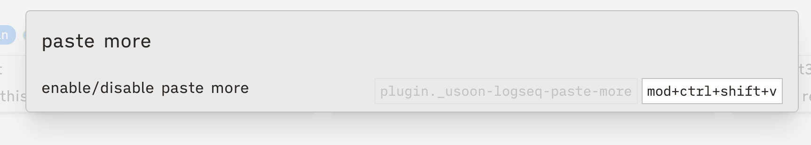
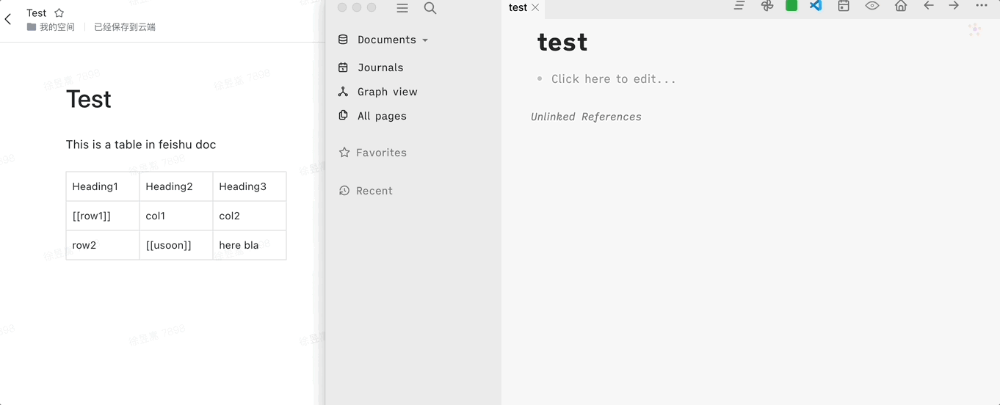

# logseq-plugin-paste-more
Retain formatting when pasting from external sources.

You can still use `mod+shift+t` to paste plain text.

**Update**: logseq has supported `Copy & Paste with rich-text formats` internally since version 0.7.1, but it doesn't parse well in some scenario. You can try this plugin to see if it pastes as your expectation.

You can enable/disable this plugin by command or pressing `mod+ctrl+shift+v` (custom the shortcut in settings).
  

## Paste Demo

**Paste Table**

**Paste from Github**

**Paste from Google Docs**

**Paste with image**

#### Settings
Whether indent headers?

#### Acknowledgement
* [turndown](https://github.com/mixmark-io/turndown) for converting html to markdown.
* [logseq-plugin-split-block](https://github.com/hyrijk/logseq-plugin-split-block) for logic of indent.