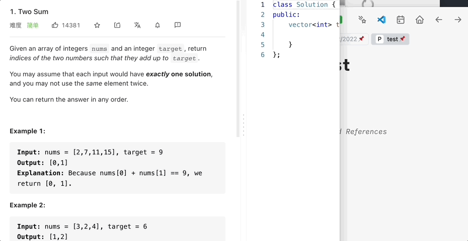

# logseq-plugin-paste-more
* I spent a lot of time pasting titles and links of leetcode problem, this simple plugin can save your time from pasting links. 
* It can also convert other common formats, the process is based on [turndown](https://github.com/mixmark-io/turndown).

### Paste with link

### Paste with head

Thanks [logseq-plugin-split-block](https://github.com/hyrijk/logseq-plugin-split-block) for outdent and indent logic!