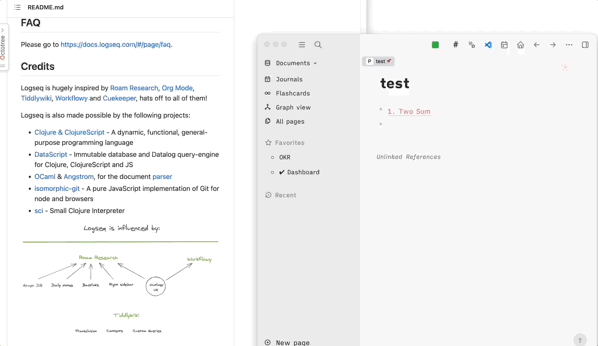
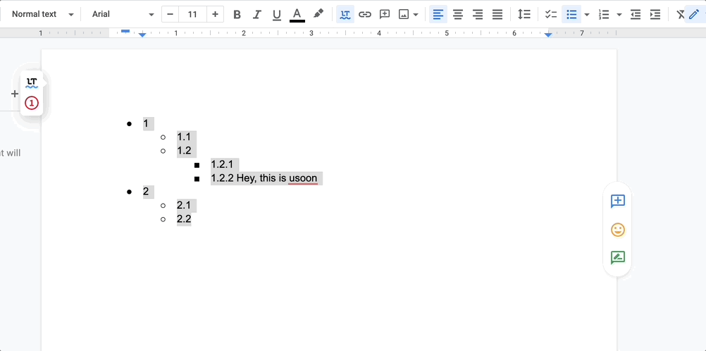

# logseq-plugin-paste-more
Retain formatting when pasting from external sources.

### Paste from Github

### Paste from Google Docs

### Paste with image link

### Acknowledgement
* [turndown](https://github.com/mixmark-io/turndown) for converting html to markdown.
* [logseq-plugin-split-block](https://github.com/hyrijk/logseq-plugin-split-block) for logic of indent.