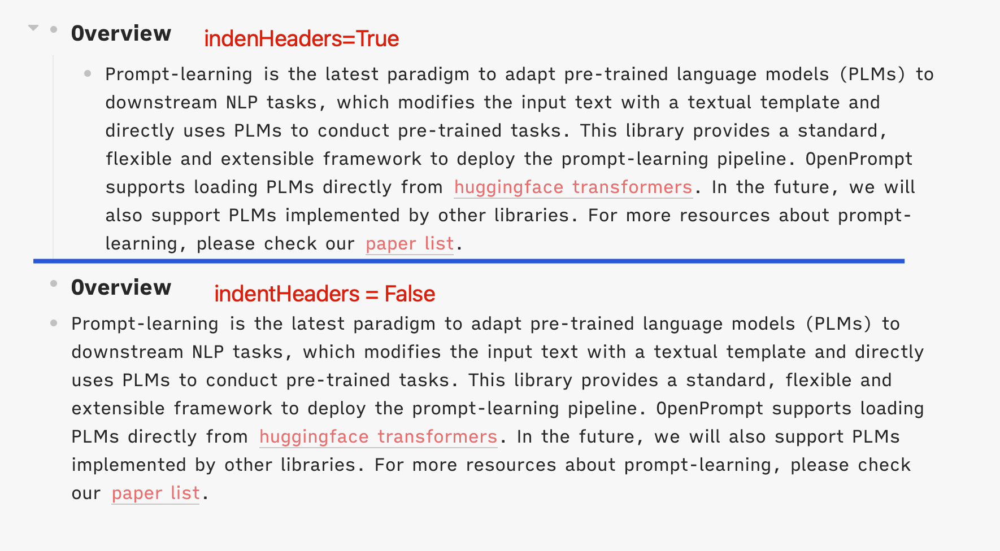

# logseq-plugin-paste-more
Retain formatting when pasting from external sources.

You can still use `mod+shift+t` to paste plain text.

Update: logseq version 0.7.1 support Copy & Paste with rich-text formats officially, but I have to stay in version 0.6.8 due to this [issue](https://github.com/logseq/logseq/issues/5431).

### Paste from Github

### Paste from Google Docs

### Paste with image link

### Settings
Whether indent headers?

### Acknowledgement
* [turndown](https://github.com/mixmark-io/turndown) for converting html to markdown.
* [logseq-plugin-split-block](https://github.com/hyrijk/logseq-plugin-split-block) for logic of indent.